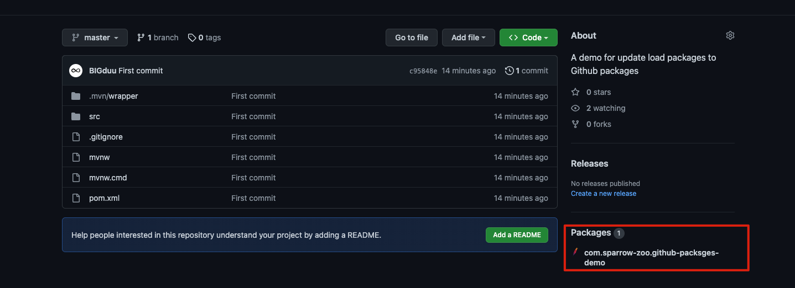
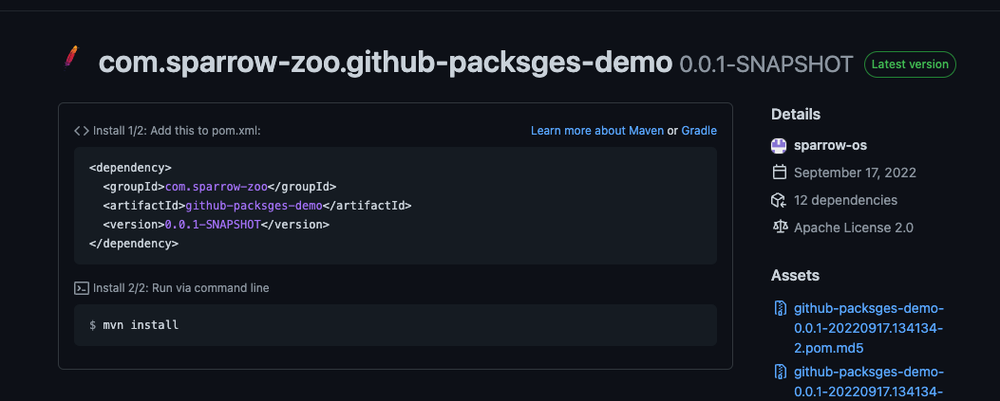

# Upload Maven packages to GitHub guide

1. Edit your ~/.m2/settings.xml  
    Please add below code block to your settings.xml file
    ```xml
    <servers>
        <server>
            <id>github</id>
            <username>${YOUR_GIT_ACCOUNT}</username>
            <password>${TOKEN}</password>
        </server>
    </servers>
    ```
    > How to generator your token
    > 1. GitHub settings
    > 2. Developer settings (The button of Tag List)
    > 3. Personal access tokens
    > 4. Generate new token
    > 5. Select all options you can see
    > 6. Then you can see your new token

2. Add the below code block to your repository `pom.xml` or `settings.xml`
    ```xml
    <profile>
        <id>github</id>
        <repositories>
            <repository>
                <id>central</id>
                <url>https://repo1.maven.org/maven2</url>
            </repository>
            <repository>
                <id>github</id>
                <url>https://maven.pkg.github.com/sparrow-os/REPOSITORY</url>
                <snapshots>
                    <enabled>true</enabled>
                </snapshots>
            </repository>
        </repositories>
    </profile>
    ```
   
3. ``mvn clean deploy`` should be successful
4. Finally, you can see the packages in your GitHub repository page as below pic

 